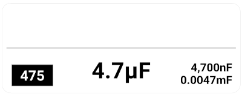
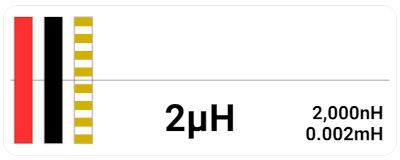
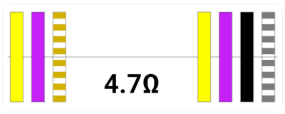

# Component Label Maker

[![License][repo_license_img]][repo_license_url]

[![Python version][python_version_img]][python_url]
[![Support][support_img]][support_url]

Component Label Maker is a Python command line utility for generating electronic component labels. The latest release includes support for ceramic capacitors, axial inductors, and axial resistors.

## Pre-Generated

If you've got yourself a substantial collection of component values, you might be able to save time by skipping the installation process and using one of the pre-generated files available below.

| Component          | Series   | Label Type | Color?   | Document
|--------------------|--------- |----------|------------|---------
| Ceramic Capacitor  | Standard | Avery 5260 | No Color | [Avery5260-Capacitor-Standard.pdf](pdfs/Avery5260-Capacitor-Standard.pdf)
| Axial Inductor     | Standard | Avery 5260 | No Color | [Avery5260-Inductor-Standard.pdf](pdfs/Avery5260-Inductor-Standard.pdf)
| Axial Inductor     | Standard | Avery 5260 | Color    | [Avery5260-Inductor-Standard-Color.pdf](pdfs/Avery5260-Inductor-Standard-Color.pdf)
| Axial Resistor     | E12      | Avery 5260 | No Color | [Avery5260-Resistor-12.pdf](pdfs/Avery5260-Resistor-E12.pdf)
| Axial Resistor     | E12      | Avery 5260 | Color    | [Avery5260-Resistor-E12-Color.pdf](pdfs/Avery5260-Resistor-E12-Color.pdf)

## Installation

  1. Clone the repository to your local machine: 
  
         git clone https://github.com/owlcreekworkshop/component-label-maker
  
  2. Navigate to the project directory: 
  
         cd component-label-maker
 
  3. Install support for Python virtual environments: 
  
         pip install --user virtualenv

  4. Create and activate the virtual environment: 

     - On Windows: 
     
           python -m venv venv` then `venv\Scripts\activate
     

     - On macOS and Linux: 
     
           python3 -m venv venv` then `source venv/bin/activate

  5. Install project dependencies: 
  
         pip install -r requirements.txt

## Usage

The `labelmaker` utility can be invoked using the following syntax:

    python3 -m labelmaker <OPTIONS> [COMMAND] [OUTFILE] [VALUES]

#### `OPTIONS`

Additional parameters that can be specified to customize the label generation process. For more information, refer to [Global Options](#global-options).

#### `COMMAND`

Specifies the label type you wish to generate. For a comprehensive list, refer to  [Commands](#commands).

#### `OUTFILE`

The desired filename for the output file which will contain the rendered labels in PDF format.

#### `VALUES`

Specifies a list of component values to generate labels for. 

Component values are provided on the command line as a comma-separated list or as the name of a file containing a list of values, with a single value per-line.

The usage of most SI prefixes is supported to denote values, like 0.1u or 4.7m.

A few lists of standard values are provided in the `/values` directory:

| Component         | Series   | Values
|-------------------|----------|--------
| Ceramic Capacitor | Standard | [values/capacitor-ceramic-standard.txt](values/capacitor-ceramic-standard.txt)
| Inductor          | Standard | [values/inductor-standard.txt](values/inductor-standard.txt)
| Resistor          | E12      | [values/resistor-standard-E12.txt](values/resistor-standard-E12.txt)

### Global Options

| Option                                 | Description
|----------------------------------------|----
| **&#x2011;&#x2011;help**               | Display the built-in help.
| **&#x2011;&#x2011;no&#x2011;color**    | Draw color bands without using color. This option will draw the outlines for all color bands but only fill the black, gray, and silver values. If you do not have a color printer you can use this option and color in the bands yourself using markers, colored pencils, or crayons.
| **&#x2011;&#x2011;divider**            | Draw a divider line through the middle of each label. This can be helpful for aligning the label if you are wrapping it over the edge of a bag or container.
| **&#x2011;&#x2011;outline**            | Draw an outline around each label. This is mostly useful for debugging.
| **&#x2011;&#x2011;skip #**             | Skip the specified number of label spaces before starting output. This can be useful for reusing partial sheets of labels.

### Commands

| Command       | Description                        | Example
|---------------|------------------------------------|--
| **capacitor** | Generate ceramic capacitor labels. | 
| **inductor**  | Generate axial inductor labels.    | 
| **resistor**  | Generate axial resistor labels.    | 

## Examples

**Generate capacitor labels using values from the command line:**

    python3 -m labelmaker capacitor labels.pdf 0.1u,4.7u

**Generate capacitor labels using values from a file:**

    python3 -m labelmaker capacitor labels.pdf values/capacitor-ceramic-standard.txt

**Generate full-color inductor labels using values from the command line:**

    python3 -m labelmaker inductor labels.pdf 0.1u,4.7u

**Generate black and white resistor labels with a folding guideline for standard E12 series:**

    python3 -m labelmaker --no-color --divider resistor labels.pdf values/resistor-standard-E12.txt

## Contributing

Please read [CONTRIBUTING.md](CONTRIBUTING.md) for details on the recommended process for submitting pull requests.

## Acknowledgments

This work was inspired by and based on:

 * https://www.zachpoff.com/resources/quick-easy-and-cheap-resistor-storage/
 * https://github.com/Finomnis/ResistorLabels
 * https://github.com/securelyfitz/ResistorLabels

## Support

If you've found my work useful and would like to show your appreciation, the simplest way to do so is by giving this repository a star! It means a lot to me.

If this work has made a significant impact on your projects and you'd like to contribute monetarily, you can also treat me to a coffee.

[python_url]: https://www.python.org/downloads/
[repo_license_url]: LICENSE
[repo_url]: https://github.com/owlcreekworkshop/component-label-maker
[checks_url]: https://github.com/owlcreekworkshop/component-label-maker/actions

[support_url]: https://www.buymeacoffee.com/owlcreekworkshop

[python_version_img]: https://badgen.net/static/Python/3.9,3.10,3.11?list
[repo_license_img]: https://badgen.net/static/License/MIT/red
[support_img]: https://badgen.net/static/Support/Buy%20Me%20a%20Coffee/yellow?icon=buymeacoffee&label
[checks_img]: https://badgen.net/github/checks/owlcreekworkshop/component-label-maker
